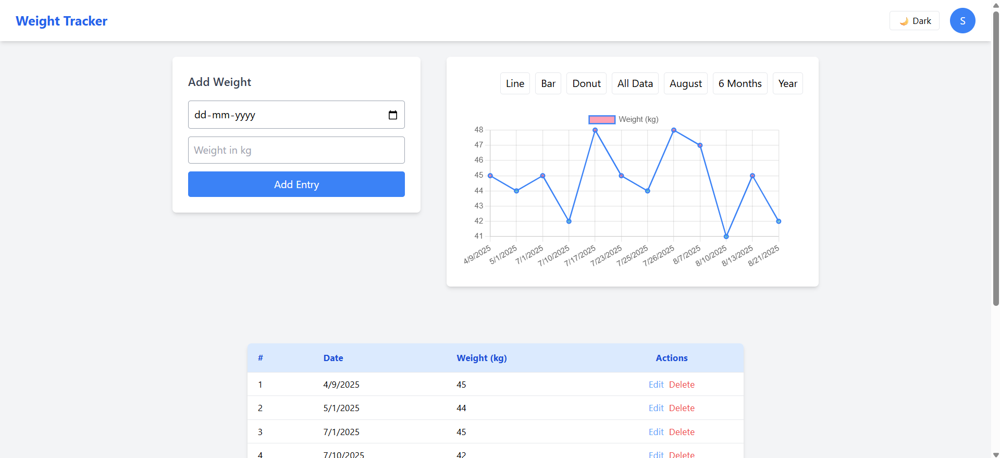
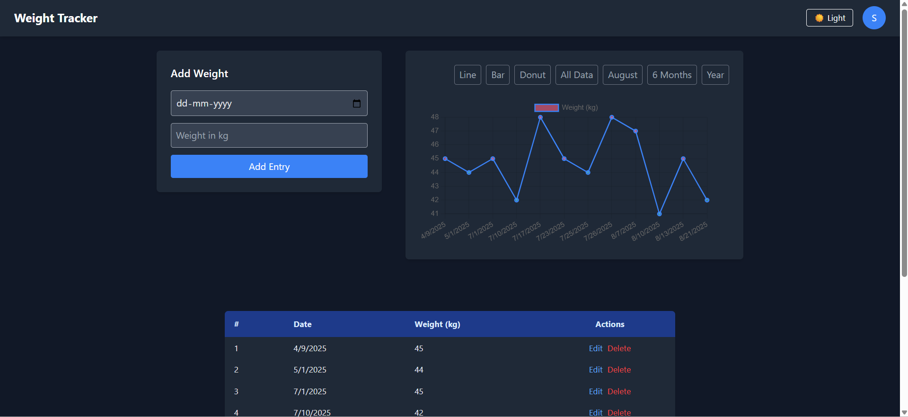

# 🌗 Weight Tracker App

A full-stack weight tracking application with **JWT authentication**, **responsive dashboard**, **data visualization (Chart.js)**, and support for **Dark/Light Mode** using Tailwind CSS.

---

## 📸 Screenshots

### 🌞 Light Mode


### 🌚 Dark Mode



## 🚀 Features

- ✅ Sign Up / Login with JWT Auth
- ✅ Add, Edit, Delete weight entries
- 📊 Visualize weight trends (line, bar, donut charts)
- 🌗 Toggle between Dark Mode and Light Mode
- 📅 Filter graph by current month, 6 months, yearly
- 📱 Responsive UI using Tailwind CSS


## ⚙️ Tech Stack

**Frontend**:
- React
- Tailwind CSS
- Chart.js
- Axios
- React Router DOM

**Backend**:
- Node.js
- Express.js
- MongoDB (Mongoose)
- JWT Authentication


## 🔧 Installation

### 1. Clone the repo

> bash

    git clone https://github.com/snowXshade/wgt-tracker.git

    cd wgt-tracker


### 2. Create .env file in ```backend-wgt```

> .env

    PORT= [your_port]

    MONGO_URL= mongodb://127.0.0.1:27017/weight-traker "or" [your_mongo_db_atlas_url]

    JWT_SECRET= [your_jwt_secret_key]


### 3. Termeinal 

> To start server

    cd backend-wgt

    npm init -y
    
    npm run dev "or" npm run start


### 4. Nwe Terminal 

> To start frontent web app

    cd weight-tracker

    npm install
    
    npm run dev 
